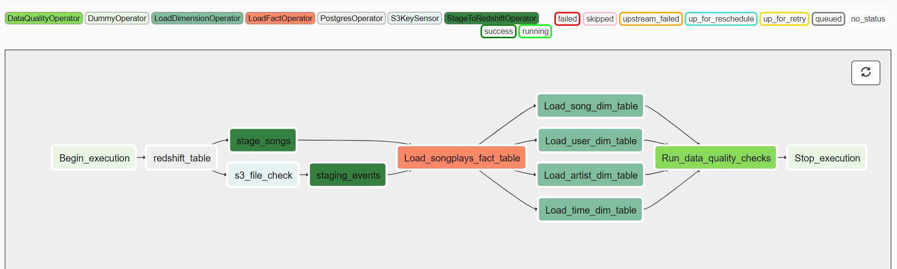
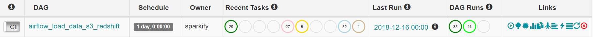
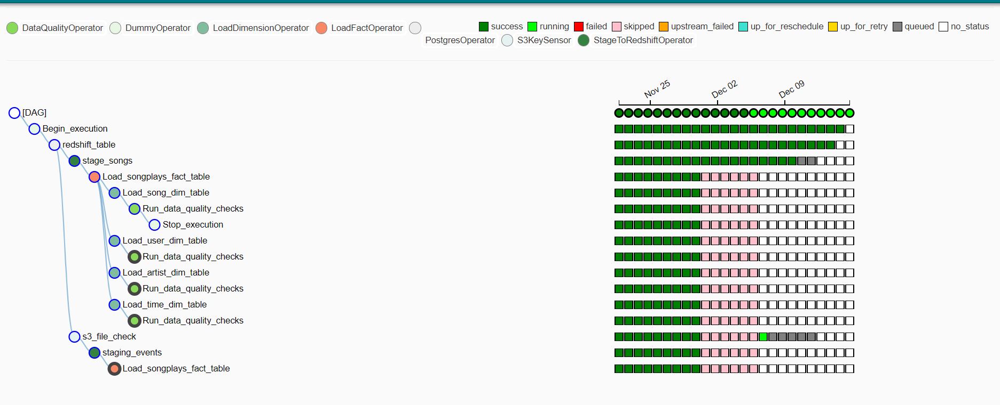

# Project: Data Pipelines with Airflow
Music streaming company, Sparkify, has decided that it is time to introduce more automation and monitoring to their data warehouse ETL pipelines and has come to the conclusion that the best tool to achieve this is Apache Airflow.

## Requirements
Create high grade data pipelines that are 
1) Dynamic and built from reusable tasks that can be monitored 
2) Allow easy backfills. 
3) Provide data quality checks
4) Run tests against their datasets after the ETL steps have been executed to catch any discrepancies in the datasets.

## Data Source
The source data resides in S3 and needs to be processed in Sparkify's data warehouse in Amazon Redshift. The source datasets consist of JSON logs that tell about user activity in the application and JSON metadata about the songs the users listen to.

## Project Overview
In this project I use Apache Airflow and create my own four custom operators to perform tasks such as staging the data, filling the data warehouse, and running checks on the data as the final step. The tasks are linked to achieve a coherent and sensible data flow within the pipeline called a DAG run (Directed Acyclic Graph). SQL queries (create tables and transformation queries) are modularized for easy usability. 

## Pipleline Build
All of the operators and task instances run SQL statements against the Redshift database. However, parameters are used to build flexible, reusable, and configurable operators which can be later apply to many kinds of data pipelines with Redshift and with other databases. The pipeline consist of four custom operators and a sesnor operator

### Stage Operator - StageToRedshiftOperator, 
The stage operator is able to load any JSON formatted files from S3 to Amazon Redshift. The operator creates and runs a SQL COPY statement based on the parameters provided. The operator's parameters specify where in S3 the file is loaded and what is the target table. The stage operator contains a templated field that allows it to load timestamped files from S3 based on the execution time and run backfills.

### Fact Operator - LoadFactOperator, 
The fact operators, utilize the SQL helper class to run data transformations. Most of the logic is within the SQL transformations and the operator is expected to take as input a SQL statement and target database on which to run the query against. A target table is provided as a parameter, that will contain the results of the transformation. Since Fact tables are usually so massive that they only records are appended to the existing table.

### Dimension Operator - LoadDimensionOperator 
Dimension loads are often done with the truncate-insert pattern where the target table is emptied before the load. Thus, the operator takes in a parameter truncate-insert(boolean) that allows switching between insert modes when loading dimensions. 

### Data Quality Operator - DataQualityOperator, 
This operator is used to run checks on the data itself. The operator's main functionality is to receive one or more SQL based test cases along with the expected results and execute the tests. For each test, the test result and expected result are checked and if there is no match, the operator raises an exception and the task will retry and fail eventually.

### Sensor Operator - S3KeySensor 
Checks timestamped file using a Poke method to see if the requested file is available. If not, all the downstream tasks are skipped rather than fail. 

**Figure 1** - Data Pipeline

## Project Build
To run the project copy the docker image, pull and execute

## Results

### Final record count

| Tables                | Record Count  |
| --------------------- |:-------------:| 
| Fact table Songplays  |  6,836        |    
| Dim table songs       | 14,896        |   
| Dim table artist      |   10,025      |
| Dim table users       |   22          |
| Dim table time        |  6,836        |

**Figure 2** - DAG runs

**Figure 3** - Final Tree View with DAG runs

## Future Builds
The pipeline takes into account the timestamp files, however if the S3 file is not present S3KeySensor(soft_fail=True), all the downstream tasks are skipped. It's a known issue on the airflow github

## Technology used
- Airflow
- Python
- AWS (S3, redshift, IAM)
- SQL 
- Docker - airflow image